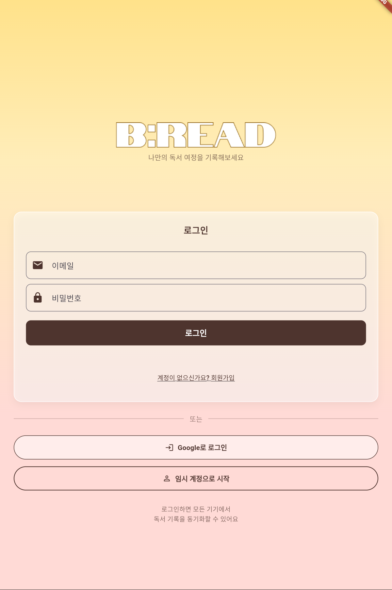
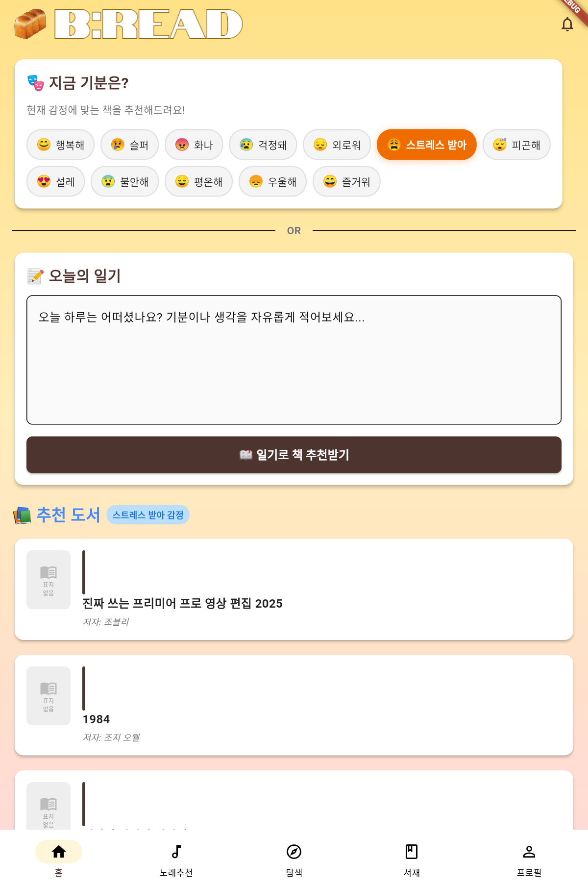
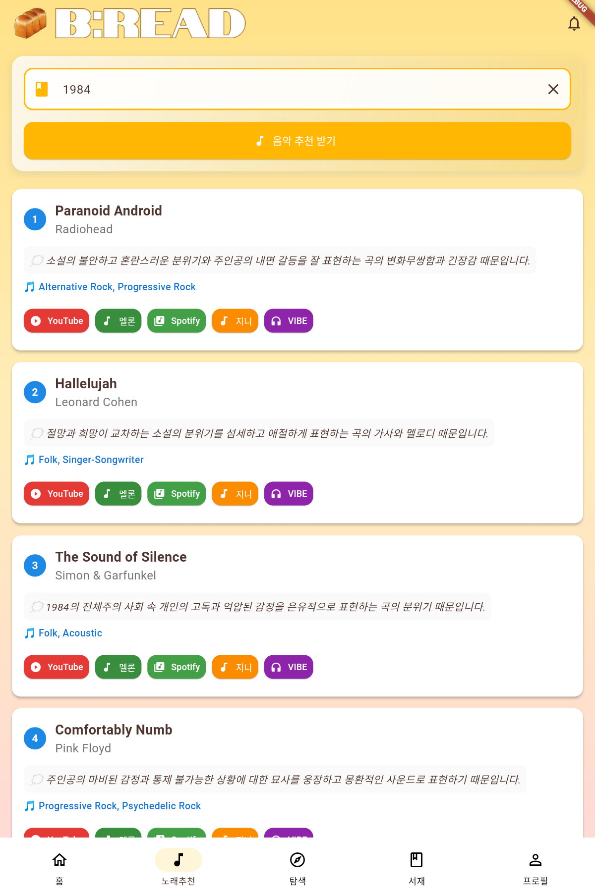
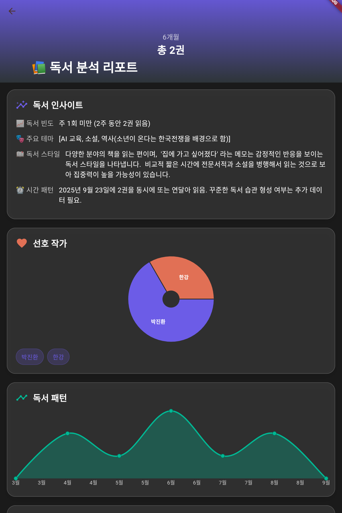

# 📚 감정 기반 도서 추천 시스템

## 📌 프로젝트 소개
사용자의 감정을 분석하여 맞춤형 도서를 추천하는 시스템입니다.  
기존의 단순 추천 시스템과 달리 세분화된 감정 분석을 기반으로 개인화된 추천을 제공합니다.

---

## 📸 Screenshots

<p align="center">
  
  
  
  
</p>

## 🚀 주요 기능

- 사용자 텍스트 입력 기반 감정 분석
- 44개 감정 카테고리 분류
- 도서 리뷰 데이터 기반 추천
- 감정 유사도 기반 도서 매칭
- 추천 도서 리스트 제공
- 독서 감상 음악 추천
- 독서 기록장
- 독서 데이터 분석

---

## 🛠 담당 내용

- 초기에는 Google Books API를 활용한 도서 검색 기능을 구현하려 했으나, 리뷰 데이터 기반 추천 시스템 구축에 한계가 있어 자체 데이터베이스를 구축하는 방향으로 전
- 도서 리뷰 데이터 수집 및 전처리 (약 49,000건)
- 감정 기반 추천 로직 설계 및 구현
- 사용자 감정과 도서 감정 간 유사도 계산 로직 구현
- AWS S3를 활용한 데이터 저장 및 관리
- JSON 데이터 파싱 및 UI 출력 로직 구현

---

## ⚙️ 기술 스택

- Kotlin
- Python
- RoBERTa
- HuggingFace Transformers
- AWS S3
- Pandas

---

## 💡 핵심 구현 포인트

- 다중 감정 분류 모델을 활용한 감정 분석
- 리뷰 데이터 기반 감정 벡터 생성
- 코사인 유사도를 활용한 추천 시스템 구현

## 📂 프로젝트 구조

- ## 📌 실행 방법

1. 프로젝트 클론
```bash
git clone https://github.com/kwonmisung/emotion-book-recommendation.git

2. Android Studio에서 프로젝트 열기
3. Gradle Sync 진행
4. 에뮬레이터 또는 실제 기기 실행
